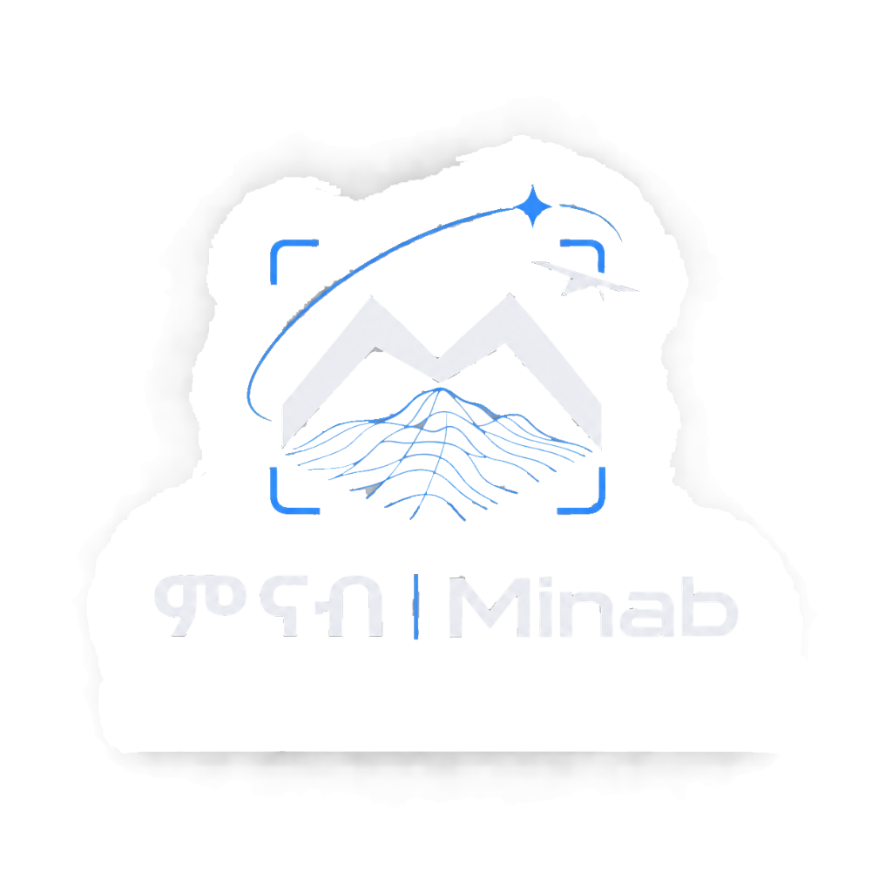

<p align="center">
  
</p>

<h1 align="center">ምናብ | MINAB</h1>

<p align="center">
  <strong>End-to-End Monocular 3D Reconstruction Platform & Interactive Web Studio</strong>
</p>

<p align="center">
  
  
  
  
  
  
</p>

---

## 🌟 Overview

**Minab (ምናብ)** is a full-stack, modular monocular 3D reconstruction system. It transforms standard smartphone or consumer video walkarounds of static objects into:
- **Calibrated Camera Trajectories** with exact position and quaternion orientation paths.
- **Dense, Colorized Multi-View Point Clouds** with statistical noise removal.
- **Full 3D Surface Meshes** in standard Wavefront (`.obj`) and Stanford Triangle (`.ply`) formats.
- **An Interactive WebGL 3D Studio** with real-time orbit controls, wireframe shading, point cloud density tuning, and 1-click artifact exports.

Minab combines classical epipolar geometry (ORB tracking, Essential matrix estimation, RANSAC camera recovery) with state-of-the-art monocular depth estimation (**Depth Anything V2**) and 3D surface meshing (**Open3D Screened Poisson / Ball-Pivoting Algorithm**).

---

## ⚠️ Important Monocular Geometry Notice (Scale Ambiguity)

When performing monocular reconstruction from single-camera RGB video without physical markers, IMUs, or lidar:
* **Translation Scale Ambiguity:** Epipolar pose recovery (`cv2.recoverPose()`) normalizes the baseline translation vector to unit length ($\|\mathbf{t}\| = 1.0$). A single camera cannot distinguish between an object 10 centimeters away and an object 10 meters away without external metric scale references.
* **Relative Depth Prior:** Neural monocular depth models (Depth Anything V2) predict **relative affine depth maps**, representing ordinal depth rather than physical metric meters.
* **Relative Units:** All coordinates ($X, Y, Z$), point clouds, camera trajectories, and mesh geometries produced by this pipeline are in **arbitrary relative units**, not metric meters.

---

## 🚀 Key Features

| Feature | Description |
| :--- | :--- |
| **Video Upload Studio** | Drag-and-drop web uploader supporting `.mp4`, `.mov`, and `.avi` with adjustable frame strides and frame caps. |
| **Live Stage Tracking** | Background worker thread with asynchronous stage progress updates (Frames &rarr; Pose &rarr; Depth &rarr; Fusion &rarr; Mesh). |
| **Interactive 3D Viewer** | Embedded Three.js WebGL viewport with OrbitControls, directional studio lighting, and studio grid floor. |
| **Multi-Layer Rendering** | Independent layer toggles for Surface Mesh, Wireframe, RGB Point Cloud, Camera Motion Arc, and Frustums. |
| **Camera View Presets** | Instant camera resets, top-down orthogonal views, and front-level inspections with point size slider controls. |
| **Input Quality Assessor** | Automatic compliance evaluation of video sharpness (Laplacian variance), orbital motion parallax, and resolution. |
| **1-Click 3D Exports** | Direct download links for `.obj` (Wavefront), `.ply` (surface mesh), `.ply` (fused point cloud), and `.json`/`.txt` (trajectories). |
| **Dual Execution Modes** | Run as a full web platform (`python run.py`) or headlessly via command-line interface (`src/pipeline.py`). |

---

## 🏗️ Architecture & Pipeline Workflow

```mermaid
flowchart TD
    subgraph Web_Layer [Web Platform & User Interface]
        UI[Video Upload Studio] -->|POST /api/upload| API[Flask Backend API]
        API -->|Enqueue Task| DB[(SQLite Job Queue)]
        Worker[Background Worker Thread] -->|Claim Job & Monitor| DB
    end

    subgraph Vision_Pipeline [3D Reconstruction Engine]
        Worker -->|Subprocess Launch| Pipe[src/pipeline.py]
        Video[Input Video Walkaround] --> Validator[Input Quality Assessor\nResolution • Sharpness • Parallax]
        Validator --> FrameExtractor[OpenCV Frame Capture\nStride Filtering & Calibration]
        
        FrameExtractor -->|Consecutive Frames| Tracker[ORB Feature Tracker\nLowe's Ratio BFMatcher]
        Tracker --> PoseEst[Essential Matrix RANSAC\ncv2.recoverPose -> R, t]
        PoseEst --> TrajAccum[Accumulate Trajectory\nT_world_cam]
        
        FrameExtractor -->|Keyframes| DepthModel[Depth Anything V2\nRelative Depth Estimation]
        
        TrajAccum & DepthModel --> Backprojector[Pinhole Backprojection\nPixel (u, v) + Depth -> 3D Points]
        Backprojector --> Fusion[Multi-View Cloud Fusion\nVoxel Downsample • Statistical Outlier Filter]
        
        Fusion --> CloudPLY[Dense Point Cloud\nfused_point_cloud.ply]
        CloudPLY --> Mesher[Open3D Surface Mesher\nPoisson / Ball-Pivoting Algorithm]
        Mesher --> MeshExports[3D Surface Mesh\n.obj Wavefront & .ply Mesh]
    end

    subgraph Studio_Output [Interactive 3D Studio & Delivery]
        TrajAccum --> TrajJSON[camera_trajectory.json]
        MeshExports & CloudPLY & TrajJSON --> ResultsAPI[Artifact Storage & Results API]
        ResultsAPI --> Viewer[Three.js WebGL 3D Studio\nMesh • Cloud • Trajectory Frustums]
    end
```

---

## 📹 Video Capture Guide & Best Practices

The monocular pipeline relies on parallax and visible texture to track features and reconstruct geometry. For optimal results, capture videos following these guidelines:

### 1. The 3 Pillars of Good Capture
* **Object Choice:** Use a static, textured object (e.g. wood carvings, chairs, backpacks, stone statues, shoes, textured boxes). Avoid featureless white walls, reflective glass, mirrors, or glossy plastics.
* **Camera Orbit:** Slowly walk or move the camera in a smooth continuous half-circle or orbital arc (1–2 meters away), keeping the subject centered in frame at all times.
* **Lighting & Clarity:** Use bright, even daylight or soft studio lighting. Avoid rapid pans or shaking that introduce motion blur.

### 2. Recommended Video Specifications
* **Resolution:** 720p (`1280x720`) or 1080p (`1920x1080`).
* **Frame Rate:** 24–30 FPS.
* **Duration:** 5–15 seconds (smooth orbital sweep).
* **Format:** MP4 (H.264 / AVC).

### 3. Prompt for AI Video Generation (Reference Visuals)
> *"Generate a 10-second handheld smartphone video of a static textured object centered on a table in a well-lit indoor room. The camera slowly moves in a smooth arc around the object from 1 to 2 meters away, keeping the object centered in frame throughout. The object has rich visible features such as edges, corners, fabric texture, rough materials, wood grain, or patterned surfaces. No reflective glass, mirrors, plain white walls, or featureless surfaces. The motion is steady and continuous, with no sudden shakes, zooms, or blurry frames. Realistic lighting, 24–30 fps, 1080p quality, no people, no moving objects, suitable for monocular 3D reconstruction."*

---

## ⚙️ Installation & Setup

### Prerequisites
* **Operating System:** Windows 10/11, Ubuntu 20.04+, or macOS
* **Python:** 3.10 recommended (guarantees prebuilt wheel availability for `open3d`, `torch`, and `opencv-python`)

### Quick Setup

```powershell
# 1. Clone the repository
git clone https://github.com/itzlead12/minab.git
cd minab

# 2. Create and activate Python 3.10 virtual environment
py -3.10 -m venv .venv
.venv\Scripts\Activate.ps1    # On Linux/macOS: source .venv/bin/activate

# 3. Install core dependencies
pip install --upgrade pip
pip install -r requirements.txt
```

---

## 💻 How to Run

### 1. Start the Interactive Web Studio

```powershell
python run.py
```

Open your browser at:
```
http://localhost:5000
```
1. Drag and drop your video file (`.mp4`, `.mov`, `.avi`).
2. Optionally adjust **Frame Stride** (default: 2) and **Max Frames** (cap for quick turnarounds).
3. Click **Upload & Start Reconstruction**.
4. Watch real-time stage progress and interact directly with the 3D model in the WebGL viewer.

### 2. Headless CLI Pipeline Execution

You can also run the reconstruction pipeline directly from the command line:

```powershell
python src/pipeline.py --video data/input_videos/sample.mp4 --camera configs/camera_default.yaml --output-dir data/output --frame-stride 2 --max-frames 40 --headless
```

#### Available CLI Arguments:
* `--video`: Path to input video file (*required*).
* `--camera`: Path to camera calibration YAML (default: `configs/camera_default.yaml`).
* `--output-dir`: Output directory for generated artifacts (default: `data/output`).
* `--frame-stride`: Process every Nth frame (default: 2).
* `--max-frames`: Maximum number of frames to process.
* `--headless`: Skip local Open3D GUI window popups (ideal for servers and background workers).
* `--progress-json`: Path to write live stage progress updates for frontend polling.

---

## 🔌 REST API Reference

The platform provides a lightweight REST API for automation and integration:

| Method | Endpoint | Description |
| :--- | :--- | :--- |
| `POST` | `/api/upload` | Upload a video (`multipart/form-data`) and enqueue a reconstruction job. Returns `job_id`. |
| `GET` | `/api/jobs` | Retrieve JSON list of all recent reconstruction jobs, statuses, and completion percentages. |
| `GET` | `/api/jobs/<job_id>` | Get real-time status, active stage (`extracting_frames`, `pose`, `depth`, `fusion`, `mesh`), and error log. |
| `POST` | `/api/jobs/<job_id>/retry` | Re-enqueue a failed or completed reconstruction job. |
| `GET` | `/api/results/<result_id>` | Fetch metadata and artifact paths for completed reconstruction results. |
| `GET` | `/files/<result_id>/<filename>` | Serve or download output files: `reconstructed_mesh.obj`, `reconstructed_mesh.ply`, `fused_point_cloud.ply`, `camera_trajectory.json`, `camera_trajectory.txt`, `input_assessment.json`. |

---

## 📁 Project Directory Structure

```text
minab/
├── backend/
│   ├── routes/
│   │   ├── jobs.py                 # Job queue status and retry endpoints
│   │   ├── pages.py                # Studio UI template routes (/ and /jobs/<id>)
│   │   ├── results.py              # 3D artifact downloads and file delivery
│   │   └── upload.py               # Video file ingestion & validation
│   ├── services/
│   │   └── storage.py              # File path resolution & dataset storage
│   ├── static/
│   │   ├── css/minab.css           # Styling & design system tokens
│   │   ├── js/viewer.js            # Three.js 3D WebGL viewer & orbit controller
│   │   └── logo.png                # Official Minab branding asset
│   ├── templates/
│   │   ├── base.html               # Base layout shell
│   │   ├── index.html              # Main Video Upload & Studio Dashboard
│   │   └── job.html                # Realtime progress & 3D Interactive Viewport
│   ├── worker/
│   │   ├── runner.py               # Background job queue daemon thread
│   │   └── vision_adapter.py       # Headless pipeline subprocess launcher
│   ├── app.py                      # Flask application factory
│   └── db.py                       # SQLite schema (datasets, jobs, results)
│
├── configs/
│   ├── camera_default.yaml         # Calibrated pinhole phone camera model (720p)
│   ├── camera_synthetic.yaml       # Synthetic reference camera model
│   └── pipeline_config.yaml        # Tracking, fusion, and meshing parameters
│
├── src/
│   ├── calibration/
│   │   ├── calibrate_camera.py     # Checkerboard camera calibration tool
│   │   └── input_validator.py      # Laplacian focus & parallax motion assessor
│   ├── depth/
│   │   └── depth_estimator.py      # Depth Anything V2 inference wrapper
│   ├── reconstruction/
│   │   ├── backprojector.py        # 2D pixel + depth to 3D point cloud projector
│   │   ├── cloud_fusion.py         # Multi-view point cloud fusion & voxel filtering
│   │   └── mesh_builder.py         # Open3D Screened Poisson / BPA surface mesher
│   ├── tracking/
│   │   ├── feature_tracker.py      # ORB feature detector & Lowe's ratio matcher
│   │   └── pose_estimator.py       # Essential matrix RANSAC pose recovery
│   ├── visualization/
│   │   └── visualizer_3d.py        # Local desktop Open3D visualizer
│   └── pipeline.py                 # Master orchestrator script
│
├── tests/
│   ├── test_backprojector.py       # Geometry & pinhole projection unit tests
│   ├── test_input_validator.py     # Blur & motion scoring tests
│   ├── test_reconstruction.py      # Fusion & Poisson meshing tests
│   └── test_tracking.py            # ORB tracking & scale normalization tests
│
├── tools/
│   └── generate_test_sequence.py   # Synthetic video test sequence generator
│
├── instruction.md                  # Video capture specification & guidelines
├── progress.md                     # Technical architecture documentation
├── requirements.txt                # Python package dependencies
├── run.py                          # Application entry point
└── README.md                       # Master project documentation
```

---

## 🧪 Testing & Verification

The codebase includes an automated test suite verifying backprojection geometry, scale normalization, ORB feature matching, depth filtering, and surface reconstruction:

```powershell
# Run all unit and integration tests
pytest tests/ -v
```

### Synthetic CI Integration Test
Generate a synthetic orbital test sequence without hardware cameras to verify math and pipeline stability end-to-end:

```powershell
# 1. Generate 30-frame synthetic walkaround video
python tools/generate_test_sequence.py --frames 30

# 2. Run pipeline headlessly on synthetic video
python src/pipeline.py --video data/input_videos/synthetic_test.mp4 --camera configs/camera_synthetic.yaml --headless
```

---

## 📜 License

This project is developed for educational, astronomical, and computer vision research purposes under the **MIT License**.
