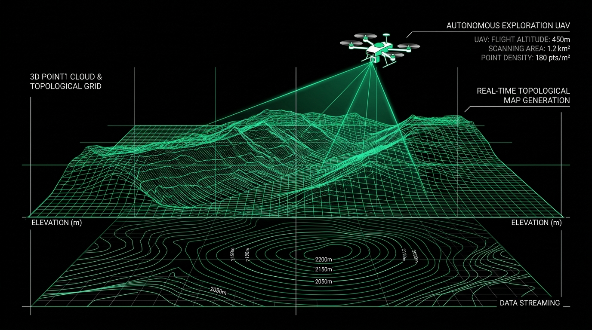
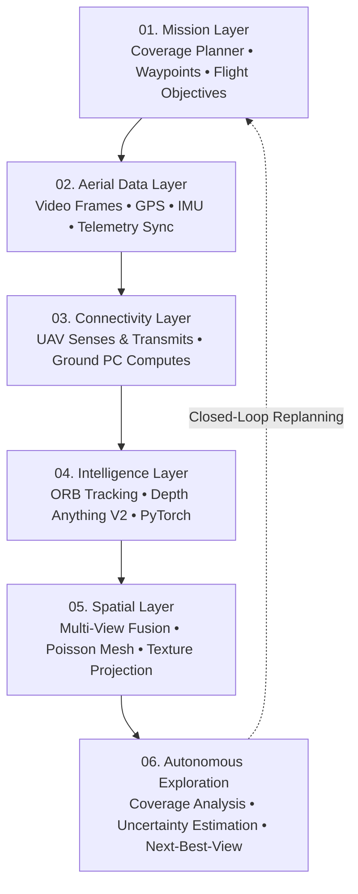

<p align="center">
  
</p>

<h1 align="center">ምናብ | MINAB</h1>

<p align="center">
  <strong>Aerospace & Computer-Vision Research Platform for Autonomous Aerial Exploration & 3D Spatial Reconstruction</strong>
</p>

<p align="center">
  <em>See. Reconstruct. Understand. Explore.</em>
</p>

<p align="center">
  
  
  
  
  
  
  
</p>

<p align="center">
  
</p>

---

## 🛰️ Core Identity

**ምናብ / Minab** is a research-oriented aerospace and computer-vision platform designed to perceive physical environments from aerial perspectives and reconstruct them into coherent, colorized 3D spatial models.

The long-term system bridges multiple foundational disciplines:
* **Computer Vision & Machine Learning** (Feature tracking, epipolar geometry, relative depth inference)
* **3D Reconstruction & Spatial Computing** (Multi-view point cloud fusion, Screened Poisson meshing)
* **UAV Systems & Autonomous Exploration** (Telemetry synchronization, coverage planning, Next-Best-View decision loops)
* **Aerospace & Planetary Science** (Autonomous surveying of unmapped, extreme, or planetary-analogue terrains)

### The Central Thesis
> **A UAV explores an environment, Minab turns what it sees into a 3D spatial model, and that model actively guides what should be explored next.**

This feedback loop makes Minab far more than a post-processing 3D reconstruction tool: **it is an active, closed-loop aerial exploration system.**

---

## 🔄 The Minab Feedback Loop

```text
                  DEFINE EXPLORATION AREA
                             │
                             ▼
                     PLAN FLIGHT ROUTE
                             │
                             ▼
                         UAV FLIES
                             │
                    ┌────────┴────────┐
                    │                 │
                 CAMERA           TELEMETRY
                    │                 │
                    └────────┬────────┘
                             ▼
                         DATA LINK
                             │
                             ▼
                      GROUND COMPUTER
                             │
                             ▼
                      MINAB PROCESSING
                             │
             ┌───────────────┼───────────────┐
             ▼               ▼               ▼
           POSE            DEPTH           FRAMES
             │               │               │
             └───────────────┼───────────────┘
                             ▼
                     3D RECONSTRUCTION
                             │
                             ▼
                     COLORED 3D MODEL
                             │
                             ▼
                   SPATIAL UNDERSTANDING
                             │
                             ▼
                  UNCERTAINTY / COVERAGE
                             │
                             ▼
                     NEXT FLIGHT PLAN
                             │
                             └──────────────────────► (Fly Again)
```

The final feedback step—evaluating reconstruction confidence, identifying unobserved occlusions, and generating next-best viewpoints—is the research core of the platform.

---

## 🔬 What Minab Does Today (Current POC)

The current working repository contains the **vision and 3D reconstruction core**. It takes continuous video walkarounds and reconstructs dense geometry and camera paths:

```text
Camera Video
     ↓
Frame Extraction (OpenCV)
     ↓
Camera Calibration (Pinhole Intrinsics)
     ↓
Feature Detection & Matching (ORB + Lowe's Ratio Test)
     ↓
Camera Pose Estimation (Essential Matrix + cv2.recoverPose())
     ↓
Monocular Relative Depth Estimation (Depth Anything V2)
     ↓
3D Point Cloud Backprojection
     ↓
Multi-View Cloud Fusion (Voxel Grid + Statistical Outlier Removal)
     ↓
Surface Reconstruction (Open3D Screened Poisson / BPA)
     ↓
Interactive 3D WebGL Studio & Export (.OBJ, .PLY, Trajectory JSON)
```

### ⚠️ Monocular Geometry & Scale Ambiguity Notice
* **Normalized Translation:** Monocular epipolar motion recovery (`cv2.recoverPose()`) resolves translation up to an arbitrary scale factor ($\|\mathbf{t}\| = 1.0$). A single camera cannot determine absolute metric distance without external metric sensors (IMU baseline, stereo baseline, or ground control points).
* **Relative Depth Prior:** Neural monocular depth models (**Depth Anything V2**) predict **relative affine depth maps** (ordinal depth relationships).
* **Coordinates:** All outputs ($X, Y, Z$), point clouds, camera trajectories, and meshes are represented in **arbitrary relative units, not physical meters**.

---

## 🏛️ The Six System Layers

Minab is architected across six modular layers:



### 01. Mission Layer
* Defines the survey perimeter, target altitude, flight velocity, camera configuration, forward/lateral overlap percentages, and survey objectives.
* Converts spatial boundaries into systematic coverage grids and PX4/MAVLink waypoint sequences.

### 02. Aerial Data Layer
* Synchronizes two essential telemetry streams:
  * **Visual Stream:** High-resolution frames, video feeds, microsecond timestamps.
  * **Flight Stream:** GPS coordinates, barometric altitude, velocity vectors, roll/pitch/yaw attitude, battery reserves, and autopilot state.

### 03. Connectivity Layer
* Keeps computation cleanly partitioned according to hardware constraints:
  ```text
                      UAV
                       │
          ┌────────────┴────────────┐
          │                         │
       Camera                 Flight Controller
          │                         │
          ▼                       MAVLink
   Companion Computer               │
          │                         │
          ├──── Video ──────────────┤
          │                         │
          └──── Telemetry ──────────┘
                       │
                       ▼
                  Ground PC (High-Performance GPU)
                       │
                       ▼
                     Minab
  ```
* The UAV flies, senses, and streams data; the ground station executes heavy neural depth inference, multi-view point cloud fusion, and surface meshing.

### 04. Intelligence Layer
* The Python ML/CV engine utilizing OpenCV, NumPy, SciPy, PyTorch, Depth Anything V2, and Open3D.
* Recovers camera trajectory from epipolar geometry, generates per-frame dense depth maps, and tracks spatial features across temporal sequences.

### 05. Spatial Layer
* Transforms raw sensor feeds into an integrated spatial environment.
* Conceptually decouples **geometry** from **appearance**:
  1. Establishes coherent, outlier-free spatial geometry via multi-view voxel fusion.
  2. Generates watertight triangle meshes via Screened Poisson reconstruction.
  3. Projects multi-view RGB radiance onto the geometry for realistic appearance.

### 06. Autonomous Exploration
* The active research layer that analyzes the reconstructed 3D model:
  * Calculates spatial coverage density and visual ray intersection angles.
  * Identifies occluded surfaces, low-confidence depth regions, and missing geometry.
  * Computes **Next-Best-View (NBV)** camera poses and issues follow-up flight missions.
  * **Loop:** *Explore &rarr; Reconstruct &rarr; Understand &rarr; Decide &rarr; Explore Again.*

---

## 🖥️ Backend Architecture

Flask orchestrates API routes and user sessions while delegating computational work to background worker processes:

```text
                    Flask App Factory
                            │
             ┌──────────────┼──────────────┐
             │              │              │
          Missions       Uploads        Results
             │              │              │
             └──────────────┼──────────────┘
                            │
                            ▼
                   Background Worker Queue
                            │
                    Python / PyTorch
                            │
             ┌──────────────┼──────────────┐
             ▼              ▼              ▼
         Tracking         Depth         Meshing
          (ORB)       (DepthAnything)  (Open3D)
```

---

## 🎨 Visual Identity & UI Language

Minab strictly follows an engineered, scientific aesthetic designed for clarity and focus:

### Three-Color System

| Color | Hex | Role |
| :--- | :--- | :--- |
| **Black** | `#000000` | Primary backdrop, deep negative space, canvas background. |
| **White** | `#FFFFFF` | Primary typography, structural borders, axes, high-contrast marks. |
| **Minab Green** | `#16A34A` | Single identity accent, active states, trajectory points, laser scans. |

* **Zero clutter:** No purples, no generic blues, no decorative neon gradients, and no cyberpunk glows.
* **Typography:** Clean, geometric sans-serif (Google Sans / Inter).
* **Interface Feel:** Aerospace flight control software meets modern scientific visualization.

### The Identity Mark
The Minab emblem is a pure, minimalist symbol representing:
* **The Mountain / Terrain:** Physical environment and topography ($M$).
* **Contour Lines:** Spatial depth and elevation modeling.
* **Flight Arc & Node:** UAV orbital trajectory and autonomous aerial surveying.
* **Viewfinder Brackets:** Computer vision, frame capture, and spatial intelligence.

---

## 🚀 Development Roadmap

```text
Phase 1: Vision POC (Completed)
  └─ Monocular video -> ORB tracking -> Depth Anything V2 -> Poisson mesh -> WebGL viewer.

Phase 2: Real Camera & Optical Validation (Current)
  └─ Real phone & drone walkarounds, lens calibration profiles, color balance consistency.

Phase 3: UAV Ground-Link Integration
  └─ Synchronous ingestion of video feeds + MAVLink telemetry logs into Minab dataset storage.

Phase 4: Autonomous Mission Planning
  └─ User selects bounding polygon; Minab auto-generates PX4 survey waypoints with overlap control.

Phase 5: Spatial Intelligence & Uncertainty
  └─ Voxel grid occupancy mapping, coverage ray-casting, reconstruction confidence heatmaps.

Phase 6: Closed-Loop Active Exploration
  └─ Autonomous Next-Best-View planning: drone automatically updates flight path to inspect unmapped areas.
```

---

## 🌌 Aerospace & Astronomy Direction

Minab investigates a fundamental question in autonomous robotics:
> **How can autonomous aerial systems visually perceive and reconstruct spatial environments that they have never previously encountered?**

While Earth's landscapes provide the immediate development ground, the platform's architectural principles directly apply to:
* **Complex, GPS-Denied Terrain:** Autonomous inspection of canyons, collapsed structures, and subterranean caverns.
* **Planetary-Analogue Exploration:** Terrestrial testbeds simulating Martian crater surveys and lunar surface exploration.
* **Autonomous Aerial Science:** Long-range aerial drones mapping geological formations without human intervention.

---

## 📁 Repository Structure

```text
minab/
├── backend/
│   ├── routes/
│   │   ├── jobs.py                 # Job queue polling & retry endpoints
│   │   ├── pages.py                # Web studio views (/ and /jobs/<id>)
│   │   ├── results.py              # 3D artifact downloads (.obj, .ply, .json)
│   │   └── upload.py               # Video ingestion & validation
│   ├── services/
│   │   └── storage.py              # File path management & dataset persistence
│   ├── static/
│   │   ├── css/minab.css           # Black/White/Green design system
│   │   ├── js/viewer.js            # Three.js 3D WebGL viewer & orbit controller
│   │   ├── logo.png                # Official Minab identity mark
│   │   └── uav_exploration.png     # Autonomous exploration concept visual
│   ├── templates/
│   │   ├── base.html               # Minimalist shell layout
│   │   ├── index.html              # Video Upload & 3D Reconstruction Studio
│   │   └── job.html                # Real-time Stage Tracker & 3D WebGL Viewport
│   ├── worker/
│   │   ├── runner.py               # Background job daemon thread
│   │   └── vision_adapter.py       # Headless pipeline subprocess runner
│   ├── app.py                      # Flask application factory
│   └── db.py                       # SQLite schema (datasets, jobs, results)
│
├── configs/
│   ├── camera_default.yaml         # Calibrated pinhole phone model (720p)
│   ├── camera_synthetic.yaml       # Synthetic reference camera model
│   └── pipeline_config.yaml        # Tracking, fusion, and meshing parameters
│
├── src/
│   ├── calibration/
│   │   ├── calibrate_camera.py     # Checkerboard camera calibration
│   │   └── input_validator.py      # Laplacian focus & parallax motion assessor
│   ├── depth/
│   │   └── depth_estimator.py      # Depth Anything V2 PyTorch inference
│   ├── reconstruction/
│   │   ├── backprojector.py        # Pinhole 2D depth -> 3D point cloud backprojection
│   │   ├── cloud_fusion.py         # Multi-view point cloud fusion & voxel filtering
│   │   └── mesh_builder.py         # Open3D Screened Poisson / BPA surface mesher
│   ├── tracking/
│   │   ├── feature_tracker.py      # ORB feature detection & Lowe's ratio matcher
│   │   └── pose_estimator.py       # Essential matrix RANSAC pose recovery
│   ├── visualization/
│   │   └── visualizer_3d.py        # Local desktop Open3D visualizer
│   └── pipeline.py                 # Master vision pipeline orchestrator
│
├── tests/
│   ├── test_backprojector.py       # Pinhole backprojection math tests
│   ├── test_input_validator.py     # Video sharpness & parallax scoring tests
│   ├── test_reconstruction.py      # Point cloud fusion & Poisson meshing tests
│   └── test_tracking.py            # ORB tracking & unit translation tests
│
├── tools/
│   └── generate_test_sequence.py   # Synthetic video test sequence generator
│
├── instruction.md                  # Video capture guidelines & AI generation prompt
├── progress.md                     # Comprehensive technical documentation
├── requirements.txt                # Python package dependencies
├── run.py                          # Web application launcher
└── README.md                       # Master platform documentation
```

---

## ⚡ Quick Start

### 1. Environment Setup

Verified on **Python 3.10** on Windows, Linux, and macOS:

```powershell
# Clone the repository
git clone https://github.com/itzlead12/minab.git
cd minab

# Create and activate virtual environment
py -3.10 -m venv .venv
.venv\Scripts\Activate.ps1    # On Linux/macOS: source .venv/bin/activate

# Install dependencies
pip install --upgrade pip
pip install -r requirements.txt
```

### 2. Launch the Web Studio

```powershell
python run.py
```
Open **`http://localhost:5000`** in your browser:
1. Upload a short orbital video (`.mp4`, `.mov`, `.avi`).
2. Watch real-time stage progress: **Frames &rarr; Pose &rarr; Depth &rarr; Fusion &rarr; Mesh**.
3. Inspect and interact with the 3D model in the WebGL viewer.
4. Download the reconstructed `.obj`, `.ply`, and camera trajectory files with one click.

### 3. Run Pipeline via Command Line

```powershell
python src/pipeline.py --video data/input_videos/sample.mp4 --camera configs/camera_default.yaml --output-dir data/output --frame-stride 2 --max-frames 40 --headless
```

### 4. Execute Automated Test Suite

```powershell
pytest tests/ -v
```

---

## 📜 Research Statement & License

**Minab (ምናብ)** is developed for computer vision, robotics, and aerospace research.

> *"Build a smarter way to see, map, understand, and explore the world from above and beyond."*

Licensed under the **MIT License**.
