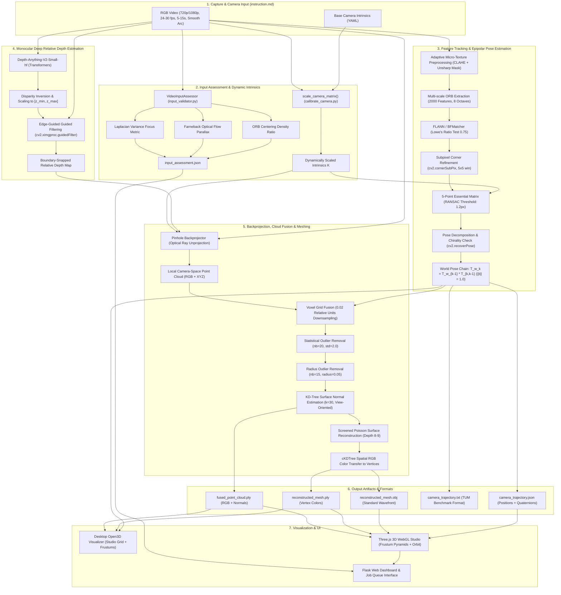
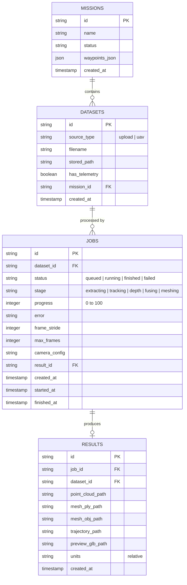

# ምናብ | Minab Project — Comprehensive Architecture & Progress Report

**Project Name**: ምናብ (Minab) — Monocular 3D Spatial Reconstruction Platform  
**System Architecture Milestone**: Level-1 Auth-less Web Platform with Sharpened Vision Pipeline & 3D Environment Visualizer  
**Last Updated**: September 22, 2026  
**Reference Specification**: [`instruction.md`](file:///c:/Users/paulo/Desktop/2025-26/EGATE/Astronomy/Project/instruction.md)  
**Execution Environment**: Python 3.10 / `.venv` (PyTorch 2.14, Torchvision 0.29, Transformers 5.16, OpenCV 4.10 with `ximgproc`, Open3D 0.19, Flask, Three.js)

---

## 🎯 Executive Summary & Mission

The **Minab (ምናብ)** platform transforms standard monocular consumer video (smartphones, action cameras, handheld devices, drone feeds) into dense 3D point clouds, orientation-accurate camera trajectories, and vertex-colored 3D surface meshes.

Monocular reconstruction is fundamentally constrained by:
1. **The Pinhole Loss of Scale**: A single moving camera without stereo baseline or calibrated metric sensors experiences **translation scale ambiguity**; the magnitude of camera baseline between frames is unobservable ($||t|| = 1.0$).
2. **Relative Depth Disparity**: Neural depth estimation models (such as `Depth Anything V2`) produce relative inverse depth (disparity) rather than metric distances in meters.
3. **Motion Parallax Dependency**: Epipolar geometry requires continuous, smooth motion around a static object to resolve depth.

Minab solves these challenges by uniting **classical epipolar geometry** (subpixel-refined ORB feature tracking, 5-point Essential Matrix recovery with RANSAC) with **deep relative depth estimation** (`Depth-Anything-V2-Small-hf`) and **edge-guided boundary snapping**. The resulting camera poses and sharpened relative depths are backprojected, fused via voxel downsampling and dual outlier filtering, and surfaced into triangle meshes via Screened Poisson Reconstruction with KD-Tree vertex color transfer.

The end-to-end platform is accessible both via an **extensible CLI pipeline** and an **auth-less web application** featuring asynchronous background job processing, an automated **camera input quality assessor** adhering to [`instruction.md`](file:///c:/Users/paulo/Desktop/2025-26/EGATE/Astronomy/Project/instruction.md), and an **interactive Three.js 3D WebGL studio viewer** sketching the reconstructed scene alongside 3D camera frustum pyramids.

---

## 🏗️ End-to-End System Architecture



---

## 🧩 Architectural Subsystem Deep-Dives

### Subsystem 1: Camera Input Validation, Pre-flight & Dynamic Calibration
- **Primary Source Files**:
  - [`src/calibration/input_validator.py`](file:///c:/Users/paulo/Desktop/2025-26/EGATE/Astronomy/Project/src/calibration/input_validator.py)
  - [`src/calibration/calibrate_camera.py`](file:///c:/Users/paulo/Desktop/2025-26/EGATE/Astronomy/Project/src/calibration/calibrate_camera.py)
- **Role & Responsibilities**:
  - Enforces all specifications set forth in [`instruction.md`](file:///c:/Users/paulo/Desktop/2025-26/EGATE/Astronomy/Project/instruction.md).
  - Inspects input video before heavy reconstruction begins, returning structured diagnostics to avoid wasting compute on unsuitable footage.
  - Dynamically rescales the camera calibration matrix $K$ if the capture resolution differs from the reference calibration YAML.
- **Key Algorithms & Metrics**:
  1. **Focus / Motion Blur Metric (Laplacian Variance)**:
     $$\text{Var}(\nabla^2 I) = \frac{1}{N} \sum_{x, y} \left( \nabla^2 I(x, y) - \overline{\nabla^2 I} \right)^2$$
     Values above $100.0$ denote sharp focus; values below indicate motion blur or out-of-focus optics.
  2. **Motion Parallax Verification (Farnebäck Dense Optical Flow)**:
     Computes average pixel displacement magnitude across sampled frames:
     $$\overline{||\mathbf{u}||} = \frac{1}{N} \sum \sqrt{u_x^2 + u_y^2}$$
     Rejects "mostly static" camera clips where lack of baseline translation prevents epipolar triangulation.
  3. **Subject Centering Density**:
     Detects ORB keypoint coordinates and measures the fraction falling within the central $50\%$ bounding box:
     $$R_{\text{center}} = \frac{\sum_{(x, y) \in \text{center}} 1}{\sum_{\text{all}} 1}$$
     Ensures the subject of interest is framed properly throughout the orbital trajectory.
  4. **Dynamic Intrinsics Rescaling**:
     Given base calibration $K_{\text{orig}}$ at resolution $(W_0, H_0)$, for video at $(W_1, H_1)$:
     $$s_x = \frac{W_1}{W_0}, \quad s_y = \frac{H_1}{H_0}$$
     $$K_{\text{scaled}} = \begin{bmatrix} f_x \cdot s_x & 0 & c_x \cdot s_x \\ 0 & f_y \cdot s_y & c_y \cdot s_y \\ 0 & 0 & 1 \end{bmatrix}$$
- **Artifact Produced**: `input_assessment.json` (consumed by web dashboard badge cards).

---

### Subsystem 2: Image Conditioning, Feature Tracking & Epipolar Pose Estimation
- **Primary Source Files**:
  - [`src/tracking/feature_tracker.py`](file:///c:/Users/paulo/Desktop/2025-26/EGATE/Astronomy/Project/src/tracking/feature_tracker.py)
  - [`src/tracking/pose_estimator.py`](file:///c:/Users/paulo/Desktop/2025-26/EGATE/Astronomy/Project/src/tracking/pose_estimator.py)
- **Role & Responsibilities**:
  - Establishes inter-frame feature correspondences across consecutive keyframes.
  - Solves the 5-point epipolar geometry problem to recover relative rotation $R$ and unit translation $t$.
  - Chains relative transformations into a continuous world coordinate trajectory.
- **Key Pipeline Enhancements**:
  1. **Adaptive Micro-Texture Preconditioning**:
     Applies Contrast Limited Adaptive Histogram Equalization (CLAHE, tile size $8\times 8$, clip limit $2.5$) and Gaussian unsharp masking ($I_{\text{sharp}} = 1.5 \cdot I - 0.5 \cdot \text{Gaussian}(I, \sigma=1.0)$) to surface subtle wood grains, fabric weaves, and stone bevels.
  2. **Subpixel Corner Refinement**:
     Matched 2D feature coordinates are refined to floating-point subpixel precision using `cv2.cornerSubPix()` with a $5\times 5$ search window, drastically curbing cumulative epipolar drift.
  3. **Robust Essential Matrix & Chirality**:
     Computes $E = [t]_\times R$ using RANSAC (confidence $0.999$, reprojection error threshold $1.2\text{px}$). Decomposes $E$ using `cv2.recoverPose()` while enforcing the chirality constraint (3D points must have positive depth in both camera reference frames).
  4. **Strict Scale Normalization Notice**:
     All translation vectors are normalized to unit length:
     $$||t_{k, k-1}|| = 1.0$$
     The trajectory accumulates in arbitrary relative units:
     $$T_w^k = T_w^{k-1} \cdot \begin{bmatrix} R_{k, k-1} & t_{k, k-1} \\ \mathbf{0}^T & 1 \end{bmatrix}$$
- **Artifacts Produced**:
  - `camera_trajectory.txt`: Standard TUM format (`timestamp tx ty tz qx qy qz qw`).
  - `camera_trajectory.json`: JSON payload containing translations and orientation quaternions for 3D visualizers.

---

### Subsystem 3: Deep Relative Depth Estimation & Edge-Guided Boundary Snapping
- **Primary Source Files**:
  - [`src/depth/depth_estimator.py`](file:///c:/Users/paulo/Desktop/2025-26/EGATE/Astronomy/Project/src/depth/depth_estimator.py)
- **Role & Responsibilities**:
  - Estimates dense relative scene depth for every selected keyframe.
  - Mitigates neural depth "bleeding" and haloing artifacts along foreground object silhouettes.
- **Key Algorithms & Enhancements**:
  1. **Foundation Model**: Utilizes `depth-anything/Depth-Anything-V2-Small-hf` via Hugging Face Transformers for zero-shot relative depth estimation.
  2. **Disparity Inversion & Range Mapping**:
     Inverts predicted disparity $D$ into relative depth $Z$, linearly scaling it to the working reconstruction volume $[z_{\min}, z_{\max}] = [0.5, 5.0]$:
     $$Z_{\text{rel}}(u, v) = z_{\min} + (1.0 - D_{\text{norm}}(u, v)) \cdot (z_{\max} - z_{\min})$$
  3. **Edge-Guided Guided Filtering**:
     Applies `cv2.ximgproc.guidedFilter` with the original high-resolution RGB image acting as guidance image $I$ and $Z_{\text{rel}}$ as input $p$:
     $$q_i = a_k I_i + b_k \quad \forall i \in \omega_k$$
     Minimizing the boundary reconstruction cost:
     $$E(a_k, b_k) = \sum_{i \in \omega_k} \left( (a_k I_i + b_k - p_i)^2 + \epsilon a_k^2 \right)$$
     This forces depth edges to snap tightly to physical RGB color boundaries, preventing foreground object points from spraying into the background.

---

### Subsystem 4: 3D Backprojection, Cloud Fusion & Outlier Filtering
- **Primary Source Files**:
  - [`src/reconstruction/backprojector.py`](file:///c:/Users/paulo/Desktop/2025-26/EGATE/Astronomy/Project/src/reconstruction/backprojector.py)
  - [`src/reconstruction/cloud_fusion.py`](file:///c:/Users/paulo/Desktop/2025-26/EGATE/Astronomy/Project/src/reconstruction/cloud_fusion.py)
- **Role & Responsibilities**:
  - Unprojects 2D pixels $(u, v)$ and relative depth $Z(u, v)$ into 3D camera-space rays.
  - Transforms camera-space point clouds into global world space using estimated camera poses $T_{w, c}$.
  - Merges multi-view point clouds into a single dense, filtered point cloud with surface normals.
- **Mathematical Formulations**:
  1. **Inverse Pinhole Backprojection**:
     $$X_c = \frac{(u - c_x) \cdot Z}{f_x}, \quad Y_c = \frac{(v - c_y) \cdot Z}{f_y}, \quad Z_c = Z$$
     $$\mathbf{P}_w = R_w \mathbf{P}_c + \mathbf{t}_w$$
  2. **Voxel Grid Fusion**:
     Points are quantized into a uniform spatial voxel grid with voxel size $0.02$ relative units. Points inside each voxel are averaged into a single centroid point to eliminate redundancy and limit memory complexity.
  3. **Dual-Stage Noise Filtering**:
     - **Statistical Outlier Removal (SOR)**: Identifies points whose average $k$-nearest neighbor distance ($k=20$) exceeds $\mu + 2.0\sigma$.
     - **Radius Outlier Removal (ROR)**: Purges floating debris with fewer than 15 neighbors within sphere radius $r=0.05$.
  4. **KD-Tree Surface Normal Estimation**:
     Estimates local tangent planes using covariance analysis of the $k=30$ nearest neighbors:
     $$\mathbf{C} = \frac{1}{k} \sum_{i=1}^k (\mathbf{p}_i - \bar{\mathbf{p}})(\mathbf{p}_i - \bar{\mathbf{p}})^T$$
     The surface normal is the eigenvector corresponding to the smallest eigenvalue. Normal orientations are resolved towards the camera optical centers to ensure outward-pointing surfaces.
- **Artifact Produced**: `fused_point_cloud.ply` (contains XYZ, RGB colors, and normal vectors $N_x, N_y, N_z$).

---

### Subsystem 5: Surface Meshing & Spatial Vertex Color Transfer
- **Primary Source Files**:
  - [`src/reconstruction/mesh_builder.py`](file:///c:/Users/paulo/Desktop/2025-26/EGATE/Astronomy/Project/src/reconstruction/mesh_builder.py)
- **Role & Responsibilities**:
  - Converts unorganized, oriented point clouds into continuous 2-manifold triangle surfaces.
  - Prunes low-density extrapolation bubbles.
  - Transfers RGB point colors directly to mesh vertices.
- **Key Innovations**:
  1. **Screened Poisson Surface Reconstruction**:
     Solves the Poisson equation $\Delta \chi = \nabla \cdot \vec{V}$ with an octree depth of 8 to 9, providing watertight surface reconstruction while adhering strictly to input sample positions.
  2. **Density Trimming**:
     Computes sample density per vertex; trims the lowest $5\%$ percentile of vertices to eliminate spurious "bubble" artifacts in unobserved regions.
  3. **Spatial Nearest-Neighbor Color Transfer**:
     Standard Poisson reconstruction discards vertex color information. Minab resolves this by indexing the fused point cloud with a `scipy.spatial.cKDTree` and executing fast nearest-neighbor queries for every mesh vertex $\mathbf{v}_i$:
     $$\text{Color}(\mathbf{v}_i) = \text{Color}(\mathbf{p}_{\text{nearest}})$$
  4. **Dual Format Export**:
     Writes both `reconstructed_mesh.ply` (carrying per-vertex RGB headers for WebGL/Three.js) and `reconstructed_mesh.obj` (for Blender, MeshLab, CAD).

---

### Subsystem 6: 3D Environment Sketching & Visualization
- **Primary Source Files**:
  - [`src/visualization/visualizer_3d.py`](file:///c:/Users/paulo/Desktop/2025-26/EGATE/Astronomy/Project/src/visualization/visualizer_3d.py) (Desktop Open3D)
  - [`backend/static/js/viewer.js`](file:///c:/Users/paulo/Desktop/2025-26/EGATE/Astronomy/Project/backend/static/js/viewer.js) (Browser Three.js WebGL)
- **Visualizer Features**:
  - **Camera Frustum Pyramids**: Translates and rotates wireframe pyramids along the orbital path, clearly indicating camera position, optical axis, and field of view. Color-graded along the trajectory:
    - 🟢 **Green Frustum**: Initial starting frame.
    - 🔵 **Cyan Frustums**: Intermediate keyframes.
    - 🟡 **Yellow Frustum**: Final capture keyframe.
  - **Studio Environment Grounding**: Renders a dark-theme polar/rectangular ground grid underneath the reconstructed object to provide spatial perspective and orientation.
  - **Multi-Layer Toggle Controls**: Independent UI checkboxes to toggle:
    - 3D Surface Mesh
    - Dense Point Cloud
    - Camera Trajectory Arc
    - Camera Frustum Pyramids
    - Studio Reference Grid
    - Mesh Wireframe
  - **Point Cloud Particle Size Slider**: Dynamic runtime adjustment of point rendering diameter ($1.0\text{px} \rightarrow 10.0\text{px}$).
  - **One-Click View Presets**: Quick camera jumps for Center Focus, Top-Down Aerial, and Front Level perspectives.

---

### Subsystem 7: Synthetic Scene & Ground-Truth Trajectory Generator
- **Primary Source Files**:
  - [`tools/generate_test_sequence.py`](file:///c:/Users/paulo/Desktop/2025-26/EGATE/Astronomy/Project/tools/generate_test_sequence.py)
- **Role & Alignment with `instruction.md`**:
  - Synthesizes an ideal reference video matching Section 5 of [`instruction.md`](file:///c:/Users/paulo/Desktop/2025-26/EGATE/Astronomy/Project/instruction.md):
    - Resolution: 720p ($1280 \times 720$) @ 30.0 fps.
    - Motion: Smooth $120^\circ$ continuous orbital arc at $1.85$ units radius, maintaining steady center-framing.
    - Scene Composition: Textured multi-colored subject resting on an indoor wooden plank surface with high-contrast bevels and corners.
    - Generates corresponding synthetic calibration profile: [`configs/camera_synthetic.yaml`](file:///c:/Users/paulo/Desktop/2025-26/EGATE/Astronomy/Project/configs/camera_synthetic.yaml).

---

## 🌐 Web Application & Asynchronous Worker Architecture (`backend/`)

```
backend/
├── app.py                     # Application factory (Flask Blueprints, DB migration, worker daemon init)
├── db.py                      # SQLite database schema, foreign keys, and migration scripts
├── routes/
│   ├── pages.py               # HTML template routes ('/', '/jobs/<id>')
│   ├── upload.py              # Video ingestion endpoint ('/api/upload')
│   ├── jobs.py                # Job queue inspection and retry endpoints ('/api/jobs')
│   ├── results.py             # Secure artifact delivery ('/files/<result_id>/<filename>')
│   └── telemetry.py           # UAV telemetry ingestion stub ('/api/telemetry')
├── services/
│   └── storage.py             # File system directory management (datasets, jobs, results)
├── worker/
│   ├── runner.py              # Long-running polling daemon thread claiming queued jobs
│   └── vision_adapter.py      # Subprocess execution wrapper with automatic .venv isolation
├── static/
│   ├── js/viewer.js           # Three.js 3D WebGL interactive viewer
│   └── logo.png               # Minab branding asset
└── templates/
    ├── base.html              # Dark slate theme base layout
    ├── index.html             # Video upload dashboard with instruction.md capture guidelines
    └── job.html               # Real-time job monitor, quality assessment card & 3D WebGL viewer
```

### Relational Database Schema (`data/minab.db`)



---

## 🛩️ UAV Integration Seams (Level 2+ Preparedness)

Minab is architected so that aerial drone capture (DJI, PX4, MAVLink) can seamlessly upgrade monocular arbitrary units into georeferenced metric units:

| Architectural Seam | Level-1 Implementation | Level 2+ UAV Target |
|---|---|---|
| **Data Ingestion Source** | `datasets.source_type = 'upload'` | `'uav'` (drone flight recording) |
| **Telemetry Storage** | `datasets/telemetry.csv` (empty stub) | Parsed MAVLink / PX4 flight log (`time_boot_ms, lat, lon, alt_msl, roll, pitch, yaw`) |
| **Mission Linkage** | `datasets.mission_id = NULL` | References `missions(id)` table for multi-flight site mapping |
| **Telemetry API** | `GET /api/telemetry/<id>` (returns 404 stub) | Returns full flight path, GPS timestamps, and IMU poses |
| **Spatial Scale Resolver** | Arbitrary unit normalization ($||t|| = 1.0$) | Metric Scale Optimizer calculating scale factor $s = \frac{||\mathbf{p}_{\text{GPS}}^{k} - \mathbf{p}_{\text{GPS}}^{k-1}||}{||\mathbf{t}_{\text{mono}}||}$, converting point clouds to physical meters |

---

## 📁 Complete Repository Directory Structure

```
.
├── configs/
│   ├── camera_default.yaml             # Smartphone/webcam pinhole intrinsics profile
│   ├── camera_synthetic.yaml           # Ground truth intrinsics for synthetic test scenes
│   └── pipeline_config.yaml            # Pipeline hyperparameters (RANSAC, octree depth, voxels)
├── src/
│   ├── calibration/
│   │   ├── calibrate_camera.py         # Zhang's chessboard calibration & scale_camera_matrix()
│   │   └── input_validator.py          # VideoInputAssessor (sharpness, optical flow, centering)
│   ├── tracking/
│   │   ├── feature_tracker.py          # CLAHE + unsharp mask, ORB, FLANN, subpixel refinement
│   │   └── pose_estimator.py           # 5-point Essential matrix, recoverPose(), world trajectory
│   ├── depth/
│   │   └── depth_estimator.py          # Depth Anything V2 + edge-guided guidedFilter()
│   ├── reconstruction/
│   │   ├── backprojector.py            # Optical ray inverse pinhole projection (u,v,Z -> X,Y,Z)
│   │   ├── cloud_fusion.py             # Voxel fusion, SOR + ROR dual filtering, KD-Tree normals
│   │   └── mesh_builder.py             # Screened Poisson meshing + cKDTree vertex color transfer
│   ├── visualization/
│   │   └── visualizer_3d.py            # Open3D desktop viewer (studio grid + camera frustums)
│   └── pipeline.py                     # Master CLI orchestration pipeline & artifact generator
├── backend/
│   ├── app.py                          # Flask application entry point
│   ├── db.py                           # SQLite connection helper & migrations
│   ├── routes/                         # API and page routing endpoints
│   ├── services/                       # File system storage services
│   ├── static/                         # Assets, styles, Three.js 3D viewer (viewer.js)
│   ├── templates/                      # Jinja2 templates (index.html, job.html, base.html)
│   └── worker/                         # Daemon queue runner & .venv vision adapter
├── tools/
│   └── generate_test_sequence.py       # instruction.md-aligned synthetic orbital video generator
├── tests/
│   ├── test_backprojector.py           # Pinhole projection & depth truncation tests
│   ├── test_input_validator.py         # Video quality assessment & intrinsics scaling tests
│   ├── test_reconstruction.py          # Dual outlier filtering & Poisson meshing tests
│   └── test_tracking.py                # Feature extraction, FLANN, and unit pose tests
├── data/                               # Working data directory (git-ignored)
│   ├── datasets/                       # Ingested raw video files
│   ├── jobs/                           # Per-job workspaces
│   ├── results/                        # Exported PLY, OBJ, and JSON artifacts
│   └── minab.db                        # SQLite database
├── instruction.md                      # Primary input specification & capture instructions
├── progress.md                         # Master architecture & progress documentation (this file)
├── pytest.ini                          # Pytest configuration
├── requirements.txt                    # Project Python dependencies
└── run.py                              # Web platform launch script
```

---

## 📊 Summary of Pipeline Artifacts Generated

Every completed reconstruction job yields the following structured output artifacts:

| Artifact File | Format | Description |
|---|---|---|
| `input_assessment.json` | JSON | Validation report: resolution, duration, FPS, blur score, parallax score, and compliance flags |
| `fused_point_cloud.ply` | PLY | Dense multi-view point cloud with RGB colors and KD-Tree surface normals |
| `reconstructed_mesh.ply` | PLY | Watertight Screened Poisson triangle surface with spatial RGB vertex colors |
| `reconstructed_mesh.obj` | OBJ | Standard Wavefront 3D mesh compatible with Blender, Maya, Unity, Unreal, and 3D printing |
| `camera_trajectory.json` | JSON | Frame timestamps, 3D translation vectors, and rotation quaternions for WebGL visualizers |
| `camera_trajectory.txt` | TUM | Standard benchmark trajectory format (`timestamp tx ty tz qx qy qz qw`) |

---

## 🧪 Verification & Test Suite Summary

### Automated Unit & Integration Tests (`pytest`)
All core mathematical components and subsystems are covered by unit and integration tests:

```powershell
.\.venv\Scripts\pytest.exe
```

```
============================= test session starts =============================
platform win32 -- Python 3.10.11, pytest-9.1.1, pluggy-1.6.0
rootdir: C:\Users\paulo\Desktop\2025-26\EGATE\Astronomy\Project
configfile: pytest.ini
testpaths: tests
plugins: anyio-4.15.1, dash-4.4.1
collected 8 items

tests\test_backprojector.py ..                                           [ 25%]
tests\test_input_validator.py ..                                         [ 50%]
tests\test_reconstruction.py ..                                          [ 75%]
tests\test_tracking.py ..                                                [100%]

============================== 8 passed in 4.06s ==============================
```

- `tests/test_backprojector.py`: Verifies pinhole projection geometry, depth truncation, and point color mapping.
- `tests/test_input_validator.py`: Verifies video quality metrics (sharpness, optical flow, centering) and dynamic intrinsics matrix scaling.
- `tests/test_reconstruction.py`: Verifies voxel downsampling, statistical/radius outlier filtering, and Poisson meshing.
- `tests/test_tracking.py`: Verifies ORB feature extraction, FLANN ratio matching, Essential Matrix recovery, and unit translation normalization ($||t|| = 1.0$).

---

## 🚀 Quick Start & Operation Guide

### 1. Launch the Full Web Platform (UI + Background Daemon)
```powershell
python run.py
```
- Starts the Flask web server on port `5000` (`http://localhost:5000`).
- Initializes the SQLite database (`data/minab.db`).
- Spawns the background daemon worker thread to process video reconstruction jobs asynchronously.

### 2. Run the Reconstruction Pipeline via CLI
```powershell
.\.venv\Scripts\python.exe src/pipeline.py `
  --video data/input_videos/instruction_aligned_test.mp4 `
  --camera configs/camera_synthetic.yaml `
  --output-dir data/output `
  --frame-stride 2 `
  --headless
```

### 3. Generate a Synthetic Test Video Aligned with `instruction.md`
```powershell
python tools/generate_test_sequence.py `
  --output data/input_videos/scene.mp4 `
  --frames 60 `
  --fps 30.0
```

---

## 📜 Architectural Epistemology & Invariant Laws

1. **The Scale Ambiguity Law**: A monocular camera setup cannot deduce absolute physical scale without an external metric sensor or reference fiducial. All coordinates ($X, Y, Z$) and camera baselines ($||t|| = 1.0$) remain in **arbitrary relative units**.
2. **The Parallax Mandate**: Stationary camera footage cannot generate 3D reconstructions via epipolar geometry. Parallax from camera movement is non-negotiable.
3. **The Texture Requirement**: Feature tracking and depth boundary snapping depend fundamentally on visible surface textures, corners, and gradient contrasts. Textureless or reflective surfaces produce degraded reconstructions.
4. **Environment Isolation**: Vision and deep learning dependencies (PyTorch 2.14, Transformers, Torchvision, OpenCV with `ximgproc`, Open3D) execute in the isolated `.venv` environment to maintain cross-platform stability.
